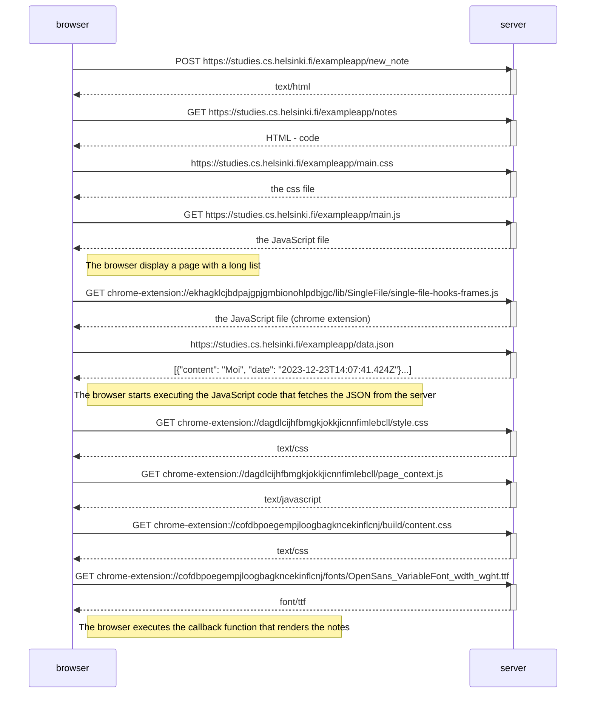

# test

```mermaid
sequenceDiagram
    participant browser
    participant server

    browser->>server: POST https://studies.cs.helsinki.fi/exampleapp/new_note
    activate server
    server-->>browser: text/html
    deactivate server

    browser->>server: GET https://studies.cs.helsinki.fi/exampleapp/notes
    activate server
    server-->>browser: HTML - code
    deactivate server

    browser->>server: https://studies.cs.helsinki.fi/exampleapp/main.css
    activate server
    server-->>browser: the css file
    deactivate server

    browser->>server: GET https://studies.cs.helsinki.fi/exampleapp/main.js
    activate server
    server-->>browser: the JavaScript file
    deactivate server

    Note right of browser: The browser display a page with a long list

    browser->>server: GET chrome-extension://ekhagklcjbdpajgpjgmbionohlpdbjgc/lib/SingleFile/single-file-hooks-frames.js
    activate server
    server-->>browser: the JavaScript file (chrome extension)
    deactivate server

    browser->>server: https://studies.cs.helsinki.fi/exampleapp/data.json
    activate server
    server-->>browser: [{"content": "Moi", "date": "2023-12-23T14:07:41.424Z"}...]
    deactivate server

    Note right of browser: The browser starts executing the JavaScript code that fetches the JSON from the server

    browser->>server: GET chrome-extension://dagdlcijhfbmgkjokkjicnnfimlebcll/style.css
    activate server
    server-->>browser: text/css
    deactivate server

    browser->>server: GET chrome-extension://dagdlcijhfbmgkjokkjicnnfimlebcll/page_context.js
    activate server
    server-->>browser: text/javascript
    deactivate server

    browser->>server: GET chrome-extension://cofdbpoegempjloogbagkncekinflcnj/build/content.css
    activate server
    server-->>browser: text/css
    deactivate server

    browser->>server: GET chrome-extension://cofdbpoegempjloogbagkncekinflcnj/fonts/OpenSans_VariableFont_wdth_wght.ttf
    activate server
    server-->>browser: font/ttf
    deactivate server

    Note right of browser: The browser executes the callback function that renders the notes
```
